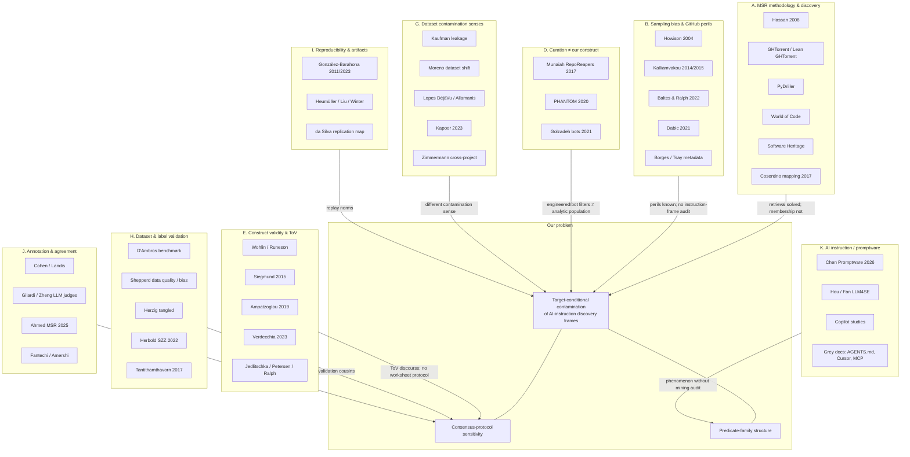

# Concept map — literature clusters for the Related Work rebuild

## Cluster reading order (for section structure)

1. **Perils & sampling** (B) → establish that path hits ≠ population membership.  
2. **Curation cousins** (D) → show engineered filters are insufficient.  
3. **Contamination senses** (G+H) → disambiguate our contamination from leakage/duplication.  
4. **Validity & reporting** (E+I) → justify protocol sensitivity and replication packages.  
5. **Annotation** (J) → situate multi-coder consensus and LLM adjudication limits.  
6. **Instruction artifacts** (K) → show phenomenon growth without methodological audit.  
7. **Gap statement** → contribution begins at the intersection of C∩S∩F.
